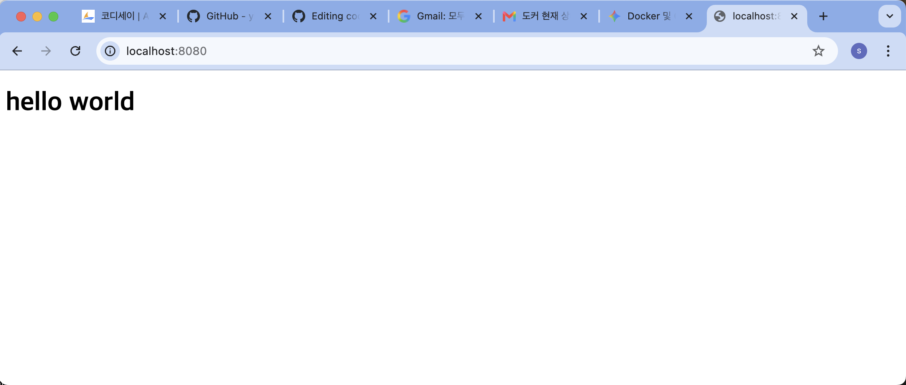
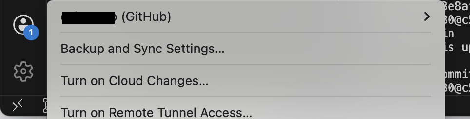

## 1) 실행 환경
- OS: macOS Sequoia 15.7.4
- Shell: bash
- Docker 엔진: OrbStack
- Docker: version 28.5.2
- Git: version 2.53.0

## 2) 수행 체크리스트
-  터미널 기본 조작 및 폴더 구성
-  권한 변경 실습
-  Docker 설치/점검
-  hello-world 실행
-  Dockerfile 빌드/실행
-  포트 매핑 접속(2회)
-  바인드 마운트 반영
-  볼륨 영속성
-  Git 설정 + VSCode GitHub 연동

## 3) 수행 로그(발췌)
### 터미널 기본조작 및 폴더 구성
- pwd
```
user@c5r2s4 ~ % pwd
/Users/user
```
- ls -al
```
user@c5r2s4 ~ % ls -al
total 8
drwxr-x---+ 18 user  user   576 Aug 11 15:01 .
drwxr-xr-x   7 root          admin         224 Aug 11 14:33 ..
-r--------   1 user  user     8 Aug 11 14:33 .CFUserTextEncoding
drwxr-xr-x   5 user  user   160 Aug 11 15:01 .docker
drwxr-xr-x  10 user  user   320 Aug 11 15:01 .orbstack
drwxr-xr-x   3 user  user    96 Aug 11 15:01 .ssh
drwx------+  2 user  user    64 Aug 11 14:34 .Trash
drwxr-xr-x   5 user  user   160 Aug 11 14:36 .vscode
drwx------+  3 user  user    96 Aug 11 14:33 Desktop
drwx------+  3 user  user    96 Aug 11 14:33 Documents
drwx------+  3 user  user    96 Aug 11 14:33 Downloads
drwx------@ 78 user  user  2496 Aug 11 15:02 Library
drwx------   3 user  user    96 Aug 11 14:33 Movies
drwx------+  3 user  user    96 Aug 11 14:33 Music
drwx------   4 user  user   160 Aug 11 15:01 OrbStack
drwx------+  4 user  user   128 Aug 11 14:33 Pictures
drwxr-xr-x+  4 user  user   128 Aug 11 14:33 Public
-rw-r--r--   1 user  user     0 Aug 11 14:43 README.md
```
- cd
```
user@c5r2s4 ~ % cd codyssey 
user@c5r2s4 codyssey % 
```
- mkdir
```
user@c5r2s4 ~ % mkdir codyssey
user@c5r2s4 ~ % ls
codyssey        Downloads        Music            Public
Desktop         Library          OrbStack         README.md
Documents       Movies           Pictures
```
- cp
```
user@c5r2s4 ~ % cp test.txt codyssey/
user@c5r2s4 ~ % cd codyssey 
user@c5r2s4 codyssey % ls
test.txt
```
- mv
```
user@c5r2s4 ~ % mv codyssey mv_test         
user@c5r2s4 ~ % ls
Desktop         Library         mv_test         Public
Documents       Movies          OrbStack        README.md
Downloads       Music           Pictures
```
- rm
```
user@c5r2s4 ~ % rm -rf codyssey
user@c5r2s4 ~ % ls
Desktop         Library         OrbStack        README.md
Documents       Movies          Pictures        test.txt
Downloads       Music
```
- cat
```
user@c5r2s4 ~ % cat test.txt 
hello world
```
- touch
```
user@c5r2s4 ~ % touch touch_test.txt
user@c5r2s4 ~ % cat touch_test.txt 
user@c5r2s4 ~ % 
```

### 권한 변경 실습
- chmod

변환 전
```
user@c5r2s4 codyssey % ls -al
total 0
drwxr-xr-x   4 user  user   128 Aug 11 15:27 .
drwxr-x---+ 21 user  user   672 Aug 11 15:27 ..
drwxr-xr-x   2 user  user    64 Aug 11 15:27 ch_dir
-rw-r--r--   1 user  user     0 Aug 11 15:25 touch_test.txt
```
변환 후
```
user@c5r2s4 codyssey % chmod 777 touch_test.txt 
user@c5r2s4 codyssey % chmod 700 ch_dir 
user@c5r2s4 codyssey % ls -al
total 0
drwxr-xr-x   4 user  user   128 Aug 11 15:27 .
drwxr-x---+ 21 user  user   672 Aug 11 15:27 ..
drwx------   2 user  user    64 Aug 11 15:27 ch_dir
-rwxrwxrwx   1 user  user     0 Aug 11 15:25 touch_test.txt
```
### Docker
- Docker 버전확인
```
user@c5r2s4 codyssey % docker --version
Docker version 28.5.2, build ecc6942
```
- Docker 데몬 동작 여부 확인
```
user@c5r2s4 codyssey % docker info
Client:
 Version:    28.5.2
 Context:    orbstack
 Debug Mode: false
 Plugins:
  buildx: Docker Buildx (Docker Inc.)
    Version:    v0.29.1
    Path:       /Users/user/.docker/cli-plugins/docker-buildx
  compose: Docker Compose (Docker Inc.)
    Version:    v2.40.3
    Path:       /Users/user/.docker/cli-plugins/docker-compose

Server:
 Containers: 0
  Running: 0
  Paused: 0
  Stopped: 0
 Images: 0
 Server Version: 28.5.2
 Storage Driver: overlay2
  Backing Filesystem: btrfs
  Supports d_type: true
  Using metacopy: false
  Native Overlay Diff: true
  userxattr: false
 Logging Driver: json-file
 Cgroup Driver: cgroupfs
 Cgroup Version: 2
 Plugins:
  Volume: local
  Network: bridge host ipvlan macvlan null overlay
  Log: awslogs fluentd gcplogs gelf journald json-file local splunk syslog
 CDI spec directories:
  /etc/cdi
  /var/run/cdi
 Swarm: inactive
 Runtimes: io.containerd.runc.v2 runc
 Default Runtime: runc
 Init Binary: docker-init
 containerd version: 1c4457e00facac03ce1d75f7b6777a7a851e5c41
 runc version: d842d7719497cc3b774fd71620278ac9e17710e0
 init version: de40ad0
 Security Options:
  seccomp
   Profile: builtin
  cgroupns
 Kernel Version: 6.17.8-orbstack-00308-g8f9c941121b1
 Operating System: OrbStack
 OSType: linux
 Architecture: x86_64
 CPUs: 6
 Total Memory: 15.67GiB
 Name: orbstack
 ID: 83d4bf93-75bb-4f1d-aa7f-0830b6376210
 Docker Root Dir: /var/lib/docker
 Debug Mode: false
 Experimental: false
 Insecure Registries:
  ::1/128
  127.0.0.0/8
 Live Restore Enabled: false
 Product License: Community Engine
 Default Address Pools:
    Base: 192.168.97.0/24, Size: 24
    Base: 192.168.107.0/24, Size: 24
    Base: 192.168.117.0/24, Size: 24
    Base: 192.168.147.0/24, Size: 24
    Base: 192.168.148.0/24, Size: 24
    Base: 192.168.155.0/24, Size: 24
    Base: 192.168.156.0/24, Size: 24
    Base: 192.168.158.0/24, Size: 24
    Base: 192.168.163.0/24, Size: 24
    Base: 192.168.164.0/24, Size: 24
    Base: 192.168.165.0/24, Size: 24
    Base: 192.168.166.0/24, Size: 24
    Base: 192.168.167.0/24, Size: 24
    Base: 192.168.171.0/24, Size: 24
    Base: 192.168.172.0/24, Size: 24
    Base: 192.168.181.0/24, Size: 24
    Base: 192.168.183.0/24, Size: 24
    Base: 192.168.186.0/24, Size: 24
    Base: 192.168.207.0/24, Size: 24
    Base: 192.168.214.0/24, Size: 24
    Base: 192.168.215.0/24, Size: 24
    Base: 192.168.216.0/24, Size: 24
    Base: 192.168.223.0/24, Size: 24
    Base: 192.168.227.0/24, Size: 24
    Base: 192.168.228.0/24, Size: 24
    Base: 192.168.229.0/24, Size: 24
    Base: 192.168.237.0/24, Size: 24
    Base: 192.168.239.0/24, Size: 24
    Base: 192.168.242.0/24, Size: 24
    Base: 192.168.247.0/24, Size: 24
    Base: fd07:b51a:cc66:d000::/56, Size: 64

WARNING: DOCKER_INSECURE_NO_IPTABLES_RAW is set
```
- Docker 이미지 목록 확인
```
user@c5r2s4 codyssey % docker images
REPOSITORY   TAG        IMAGE ID    CREATED    SIZE
```
- 컨테이너 실행/중지/목록 확인
```
user@c5r2s4 codyssey % docker ps -a
CONTAINER ID   IMAGE     COMMAND    CREATED    STATUS    PORTS    NAMES
```
- Docker 로그 확인
```
user@c5r2s4 codyssey % docker logs ubuntu
root@107a748f8bf5:/app# exit
exit
```
- Docker 리소스 확인
```
user@c5r2s4 codyssey % docker stats
CONTAINER ID   NAME     CPU %     MEM USAGE / LIMIT     MEM %     NET I/O       BLOCK I/O     PIDS 
de8e8c1c761d   html     0.00%     6.078MiB / 15.67GiB   0.04%     1.35kB / 318B   8MB / 4.1kB   7 
```
- hello-world실행
```
user@c5r2s4 codyssey % docker run hello-world     

Hello from Docker!
This message shows that your installation appears to be working correctly.

To generate this message, Docker took the following steps:
 1. The Docker client contacted the Docker daemon.
 2. The Docker daemon pulled the "hello-world" image from the Docker Hub.
    (amd64)
 3. The Docker daemon created a new container from that image which runs the
    executable that produces the output you are currently reading.
 4. The Docker daemon streamed that output to the Docker client, which sent it
    to your terminal.

To try something more ambitious, you can run an Ubuntu container with:
 $ docker run -it ubuntu bash

Share images, automate workflows, and more with a free Docker ID:
 https://hub.docker.com/

For more examples and ideas, visit:
 https://docs.docker.com/get-started/
```
- ubuntu컨테이너 실행 후 간단 명령어 수행기록
```
root@107a748f8bf5:/app# ls
root@107a748f8bf5:/app# echo "hello world"
hello world
```
- 컨테이너 종료/유지(attach/exec)의 차이
 - attach : 
 컨테이너를 실행할 때 생성된 메인 프로세스(PID 1)의 표준 입출력에 직접 연결합니다.
 컨테이너 화면을 그대로 터미널로 가져오는 방식이므로, 작업 완료 후 exit를 입력하여 빠져나오면 메인 프로세스가 종료되면서 컨테이너
 자체가 중지됨

 - exec :
 이미 실행 중인 컨테이너 내부에 별도의 보조 프로세스를 새로 띄워 진입합니다.
 메인 프로세스와 독립적인 공간을 사용하므로, 내부 작업 종료 후 exit를 입력해 터미널을 빠져나와도 보조 프로세스만 종료될 뿐 컨테이너   는 계속 실행 상태를 유지한다.

- 커스텀 이미지(Dockerfile)
```
FROM nginx:alpine --웹서버 베이스

LABEL description="nginx html Container" \
      environment="development" ---해당 이미지 메타데이터 설정
COPY app/ /usr/share/nginx/html --필요한 파일 복사
```
```
user@c5r2s4 codyssey % docker build -t my_html .
user@c6r3s8 codyssey % docker run -d -p 8080:80 --name myweb myweb
user@c5r2s4 codyssey % curl localhost:8080
<!DOCTYPE html>
<html>
<head>
    <h1>hello world</h1>
</head>
<body>
</body>
</html>%
```
- 결과이미지


- Docker 바인드 마운트
```
user@c5r6s7 codyssey % docker run -dit -v /Users/user/:/app --name ubuntu ubuntu
```
컨테이너 마운트 정보 확인
```
docker inspect ubuntu
```
```
"Mounts": [
            {
                "Type": "bind",
                "Source": "/Users/user/codyssey/app",
                "Destination": "/app",
                "Mode": "",
                "RW": true,
                "Propagation": "rprivate"
            }
```
- 검증
```
user@c5r6s7 codyssey % docker exec -i -t ubuntu
root@f4b2bb103a0b:/app# cat helloworld 
hello world!
```

호스트에서 hello world!문구에 modified helloworld를 추가
```
root@f4b2bb103a0b:/app# cat helloworld  
hello world!
modified helloworld
```

- Docker 볼륨
생성 및 연결
```
user@c5r6s7 ~ % docker volume create my_data
user@c5r6s7 ~ % docker run -dit -v my_data:/app --name ubuntu_vol ubuntu
```
컨테이너 내부에서 파일 생성
```
root@dc4dd90d12e8:/app# echo "vol test" >> test.txt
```
컨테이너 영속성 검증
```
user@c5r6s7 ~ % docker exec -it ubuntu_2 bash
root@73ac9291043a:/app# cat test.txt 
vol test
```
### Git 설정 및 GitHub/VSCode 연동
- 사용자 정보 설정
```
user@c5r6s7 codyssey % git config user.name "osh98pro"       
user@c5r6s7 codyssey % git config user.email "osh98pro@gmail.com"
user@c5r6s7 codyssey % git config --list
credential.helper=osxkeychain
core.repositoryformatversion=0
core.filemode=true
core.bare=false
core.logallrefupdates=true
core.ignorecase=true
core.precomposeunicode=true
remote.origin.url=https://github.com/osh98pro/codyssey.git
remote.origin.fetch=+refs/heads/*:refs/remotes/origin/*
branch.master.remote=origin
branch.master.merge=refs/heads/master
user.name=osh98pro
user.email=osh98pro@gmail.com
```
- 기본 브랜치 설정
```
user@c5r6s7 codyssey % git config --global init.defaultBranch main
user@c5r6s7 codyssey % git branch -m master main
user@c5r6s7 codyssey % git push -u origin main
user@c5r6s7 codyssey % git push origin --delete master
To https://github.com/osh98pro/codyssey.git
 - [deleted]        master
user@c5r6s7 codyssey % git branch --list
* main
```
- vscode 연동 증거


## 트러블 슈팅
우분투에서 docker run 명령어 사용시 -t 옵션을 안쓰면 백그라운드 자동종료가 된다.
이를 방지하기 위해 -t 옵션을 사용하여 터미널을 연결시켜줘야 자동종료가 안된다.
```
user@c5r6s7 codyssey % docker run -d ubuntu
user@c5r6s7 codyssey % docker start vigorous_chebyshev 
vigorous_chebyshev
```
우분투에서 docker 명령어 사용시 -i옵션을 안쓰면 터미널까지 들어가더라도 어떤 명령어든 상호작용이 안도니다
이를 방지하기 위해 -i 옵션을 사용하여 터미널을 연결시켜줘야한다.
```
user@c5r6s7 codyssey % docker run -dt --name ubuntu_2 ubuntu
3e8fdd162159ef191f65cf04649b59466f92f4c8e8821a27d2ae6abb81a8edfa
user@c5r6s7 codyssey % docker exec -it ubuntu_2 bash
root@3e8fdd162159:/# exit
exit
터미널 종료가 안되어 강제종료함
```
